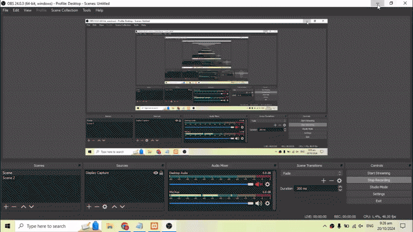
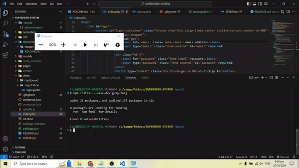
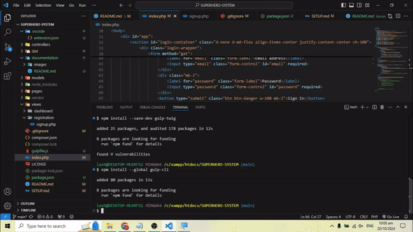
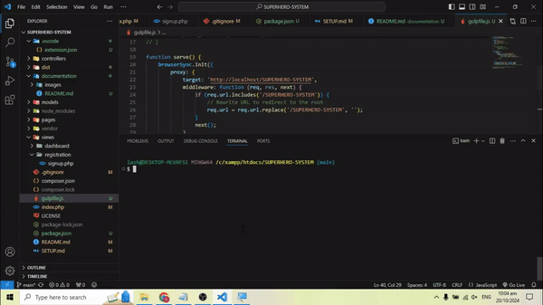

## Step by step to run our Project
This tutorial is horrific consider it by yourself patience is virtue.

```term
For explicit concern we used template engine to handle client-side complexity measures.
```

### 1. Install Composer and NodeJS
- For composer, please refer [here](https://getcomposer.org/download/)
- For NodeJS, please refer [here](https://nodejs.org/en)
- For PHP CLI, since we already have XAMPP this is optional but you may wanted to [check this out](https://windows.php.net/download/)

### 2. Install Dependencies exist to our Supersystem (Partial for now)
```powershell
composer require twig/twig
```

### 2.2 Tutorial (Simple)

1. In XAMPP inside Apache open `Config` then Open your httpd.conf usually locates in `C:\xampp\apache\conf\httpd.conf` directory

```powershell
<Directory "C:/xampp/htdocs/SUPERHERO-SYSTEM">
    Options Indexes FollowSymLinks
    AllowOverride All
    Require all granted
</Directory>
```

Copy this and paste it in the very last lines



2. Install Gulp with these two commands

```powershell
npm install --global gulp-cli
```


```powershell
npm install --save-dev gulp gulp-twig
```




3. To run our project make sure that XAMPP Apache Server is running and then execute this command
```powershell
gulp
```

So after all of that please don't forget to read my project structure [here](SETUP.md)
and then for list of possibly errors you may experience I've just list down inside [here](errors/README.md) 

## Special Notes
- Twig is a library available to PHP as template engine to organize our client-side UI design pages.
> For learning, please refer [here](https://twig.symfony.com/) 
- Gulp is a separated NodeJS plugin that you can use to initialize apache missing auto-reload feature.